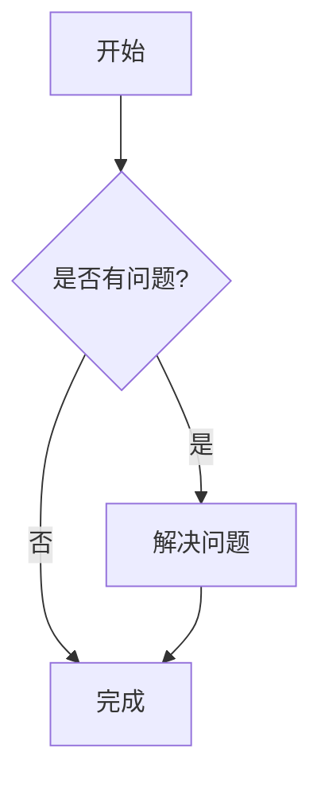
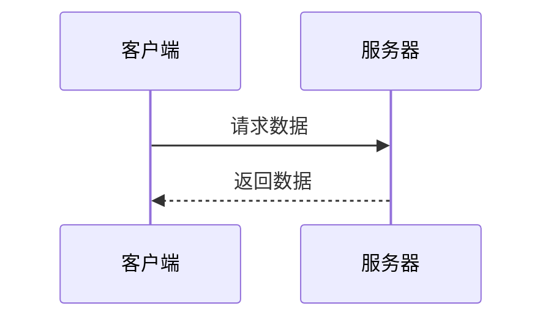
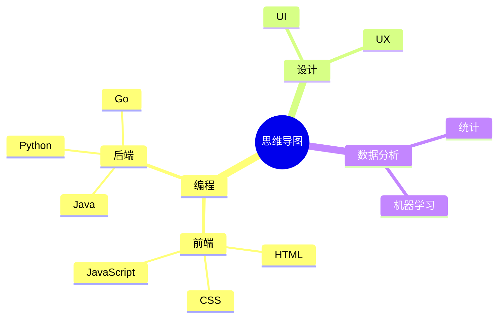
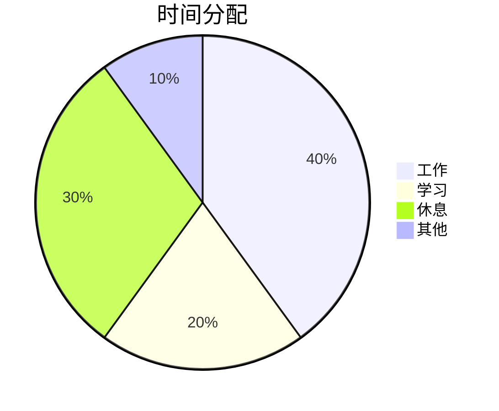
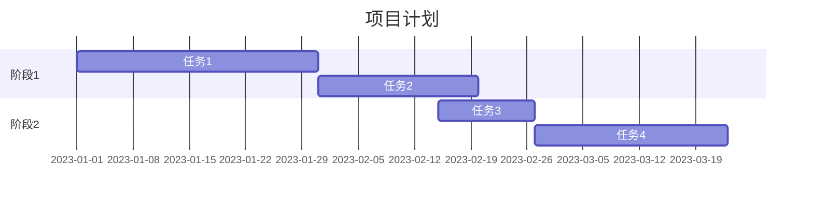

# Markdown 预览网站

这是一个使用 Vue 3 开发的 Markdown 文档预览网站，支持实时编辑预览、主题切换及文档管理等功能。

## 功能特点

### 编辑器

- 支持 Markdown 语法高亮
- 实时编辑体验
- 支持常用 Markdown 语法

### 预览器

- 实时渲染 Markdown 为 HTML
- 支持代码块语法高亮
- 支持数学公式渲染

### 工具栏

- 新建文档
- 保存文档
- 导出为 HTML
- 导出为 PDF
- 主题切换（明亮/黑暗模式）

### 文档管理

- 支持创建多个文档
- 支持切换不同文档
- 支持删除文档
- 使用 localStorage 本地存储文档内容

## 技术栈

- Vue 3 + Composition API
- Vite (构建工具)
- Marked (Markdown 解析)
- Highlight.js (代码高亮)
- KaTeX (数学公式渲染)
- Tailwind CSS (样式框架)
- html2pdf.js (PDF 导出)

## 环境要求

- Node.js 14.x 或更高版本
- npm 6.x 或更高版本
- 现代浏览器（Chrome, Firefox, Safari, Edge 等）

## 项目设置与开发

### 安装依赖

```bash
# 安装项目依赖
npm install
```

### 开发模式

```bash
# 启动开发服务器
npm run dev
```

开发服务器默认运行在 http://localhost:5173

### 构建生产版本

```bash
# 构建生产版本
npm run build
```

### 预览生产构建

```bash
# 预览生产构建
npm run preview
```

## 目录结构

```
view-markdown/
├── public/                   # 静态资源目录
│   ├── docs/                 # 文档文件
│   │   ├── charts-guide.md   # 图表使用指南
│   │   └── emoji-reference.md  # 表情符号参考
│   ├── markdown-icon.svg     # 网站图标
│   ├── charts-guide.md       # 图表指南
│   └── lixin.jpg             # 示例图片
├── src/                      # 源代码目录
│   ├── assets/               # 资源文件
│   │   └── styles/           # 样式文件
│   │       ├── style.css     # 全局样式
│   │       └── preview.css   # 预览区样式
│   ├── components/           # Vue组件
│   │   ├── Editor.vue        # Markdown编辑器组件
│   │   ├── Preview.vue       # Markdown预览组件
│   │   ├── FileList.vue      # 文件列表组件
│   │   ├── Toolbar.vue       # 工具栏组件
│   │   ├── ContextMenu.vue   # 右键菜单组件
│   │   ├── ContextMenuItem.vue  # 右键菜单项组件
│   │   ├── EmojiPicker.vue   # 表情选择器组件
│   │   └── ImagePreview.vue  # 图片预览组件
│   ├── stores/               # 状态管理
│   │   ├── documentStore.js  # 文档状态管理
│   │   └── themeStore.js     # 主题状态管理
│   ├── App.vue               # 主应用组件
│   ├── main.js               # 应用入口文件
│   └── index.html            # HTML模板(空)
├── index.html                # 主HTML页面
├── package.json              # 项目依赖配置
├── package-lock.json         # 依赖版本锁定文件
├── vite.config.js            # Vite配置文件
├── tailwind.config.cjs       # Tailwind CSS配置
├── postcss.config.cjs        # PostCSS配置
└── README.md                 # 项目文档
```

## Markdown 语法支持

本编辑器支持以下 Markdown 语法：

### 标题

```markdown
# 一级标题

## 二级标题

### 三级标题
```

### 强调

```markdown
_斜体_ 或 _斜体_
**粗体** 或 **粗体**
```

### 列表

```markdown
- 无序列表项
- 无序列表项
  - 嵌套列表项

1. 有序列表项
2. 有序列表项
```

### 链接和图片

```markdown
[链接文字](https://example.com)

```

### 代码

````markdown
行内代码：`const example = "hello"`

代码块：

```javascript
function hello() {
  console.log("Hello, world!");
}
```
````

### 表格

```markdown
| 表头 1 | 表头 2 |
| ------ | ------ |
| 单元格 | 单元格 |
| 单元格 | 单元格 |
```

### 数学公式

```markdown
行内公式：$E=mc^2$

块级公式：

$$
\frac{d}{dx}e^x = e^x
$$
```

## 图表功能

Markdown 编辑器现在支持使用 Mermaid 语法创建各种图表：

### 流程图



#### 语法示例:

````

````

### 序列图



#### 语法示例:

````

````

### 思维导图



#### 语法示例:

````

````

### 饼图



#### 语法示例:

````

````

### 甘特图



#### 语法示例:

````

````

## 特性

- **实时预览**: 同时查看编辑内容和渲染结果
- **语法高亮**: 支持多种编程语言的代码高亮
- **数学公式**: 支持 LaTeX 数学公式
- **主题切换**: 支持明亮和暗黑模式
- **文件管理**: 创建、编辑、删除和导出 Markdown 文档
- **响应式设计**: 适配桌面和移动设备
- **自动保存**: 实时保存文档内容
- **拖拽调整**: 可调整编辑区和预览区的宽度比例

## 预览


[➡️ 预览地址地址](https://preview-markdown-gamma.vercel.app) Vercel 部署，打不开请使用魔法 🚀🚀🚀
