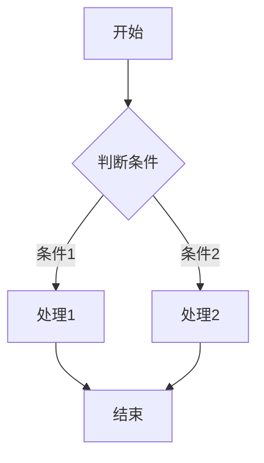
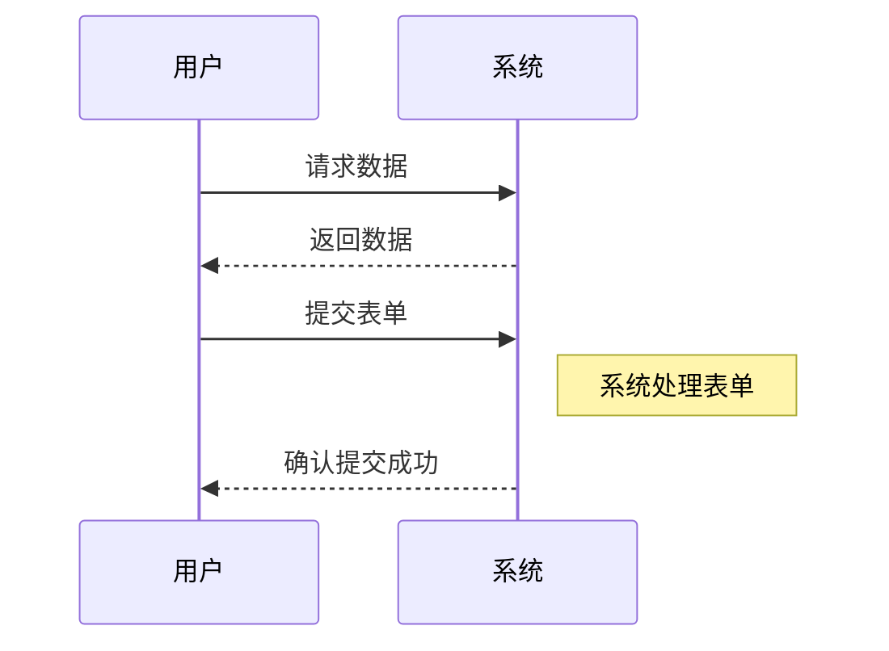
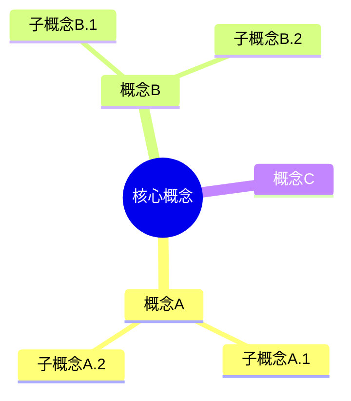
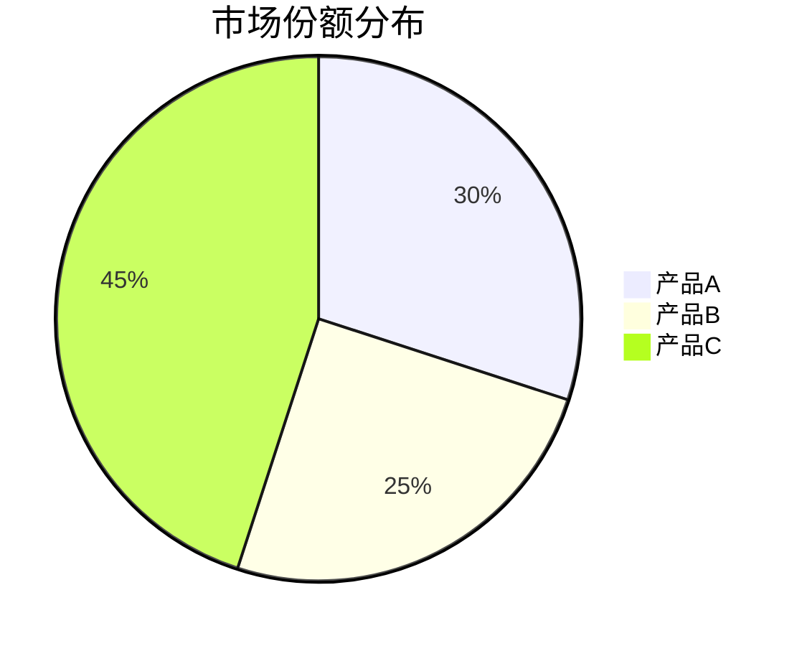
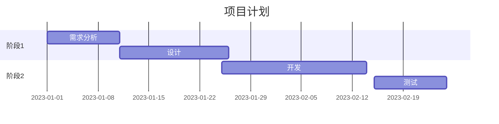
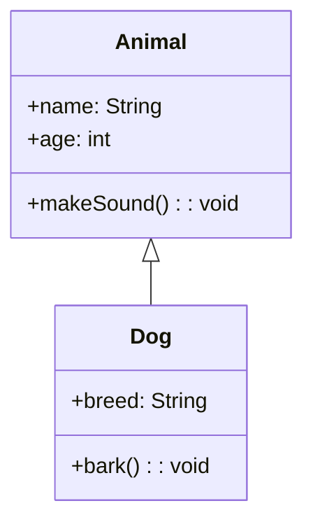

# 图表创建指南 :rocket:

在 Markdown 编辑器中，你可以使用多种图表和特殊语法来丰富你的文档。本指南将帮助你掌握这些功能。

## 目录

[[toc]]

## Emoji 表情符号 :smile:

你可以在文档中使用各种表情符号，只需要输入对应的短代码即可。

常用 emoji 示例：

- :smile: 微笑表情 - `:smile:`
- :heart: 爱心 - `:heart:`
- :thumbsup: 点赞 - `:thumbsup:`
- :star: 星星 - `:star:`
- :warning: 警告 - `:warning:`
- :bulb: 灯泡（提示） - `:bulb:`
- :book: 书本 - `:book:`
- :rocket: 火箭 - `:rocket:`
- :zap: 闪电 - `:zap:`
- :bug: 程序错误 - `:bug:`

更多表情符号可以通过编辑器的右键菜单中的"插入表情"选项来添加。

## 流程图 (Flowchart) :chart_with_upwards_trend:

流程图用于展示一个过程的步骤或决策路径。

### 基本语法

- 节点形状：

  - `[方形]`
  - `(圆形)`
  - `{菱形}`
  - `([圆角方形])`

- 连接线：
  - `-->` 箭头连线
  - `---` 无箭头连线
  - `-->|文本|` 带文本的箭头

## 序列图 (Sequence Diagram) :left_right_arrow:

序列图用于展示对象之间的交互序列。

### 基本语法

- `participant A` 定义参与者
- `A->>B` 实线箭头（请求）
- `A-->>B` 虚线箭头（响应）
- `Note right of A` 添加注释

## 思维导图 (Mindmap) :brain:

思维导图用于展示概念和想法的关系。

### 基本语法

- `root((文本))` 定义根节点
- 使用缩进表示层级关系

## 饼图 (Pie Chart) :pie:

饼图用于展示数据的比例关系。

### 基本语法

- `pie title 标题` 定义饼图标题
- 每行定义一个数据项及其值

## 甘特图 (Gantt Chart) :calendar:

甘特图用于项目计划和任务进度可视化。

### 基本语法

- `title 标题` 定义甘特图标题
- `dateFormat YYYY-MM-DD` 设置日期格式
- `section 部分名` 分组任务
- 任务定义：`任务名 :任务ID, 开始日期, 持续时间`

## 类图 (Class Diagram) :package:

类图用于展示类之间的关系和结构。

### 基本语法

- `class 类名` 定义一个类
- `+` 公共属性/方法
- `-` 私有属性/方法
- `<|--` 继承关系
- `*--` 组合关系
- `o--` 聚合关系

## 数学公式 :1234:

你可以使用 KaTeX 语法在文档中插入数学公式。

行内公式：$E = mc^2$

独立公式：

$$
\frac{n!}{k!(n-k)!} = \binom{n}{k}
$$

### 基本语法

- `$公式$` 行内公式
- `$$公式$$` 独立公式

## 任务列表 :white_check_mark:

可以创建交互式任务列表：

- [x] 已完成任务
- [ ] 待办任务
- [ ] 更多任务...

### 基本语法

- `- [x]` 已完成任务
- `- [ ]` 未完成任务

## 提示 :bulb:

1. 可以使用编辑器的右键菜单快速插入图表模板
2. 图表会在预览区域自动渲染
3. Emoji 可以通过表情选择器或直接输入短代码（如`:smile:`）插入
4. 使用同步滚动功能可以同时查看编辑内容和预览效果
